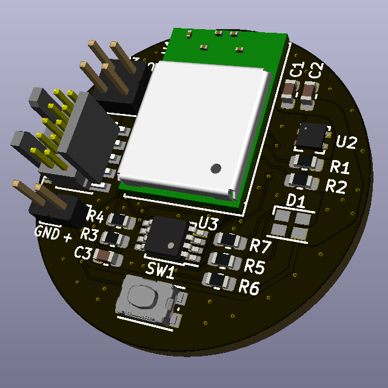
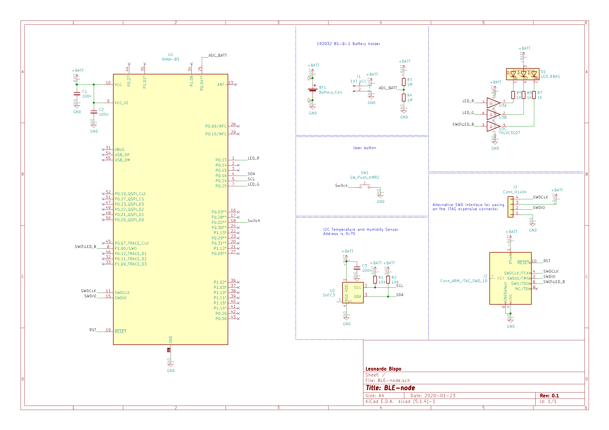

# BLE-node-u-blox

u-blox NINA-B3 BLE node, based on nRF52840 and SHTC3

[](https://github.com/ldab/BLE-node-u-blox/releases/latest)
[](https://github.com/ldab/BLE-node-u-blox/blob/master/LICENSE)

[](https://github.com/ldab/BLE-node-u-blox)



## TODO

- [ ] 3D enclosure

## Energy Budget

* 5mA active current;
* Wakes every hour;
* 4uA Sleep current;
* CR2032 ~235mAh;

**Battery life = ???**

## Nordic SDK

* This is based on nRF5_SDK_16.0.0_98a08e2, get yours here: https://www.nordicsemi.com/Software-and-tools/Software/nRF5-SDK/Download

## Cloud Gateway

* Raspberry Pi + Grafana + InfluxDB;

https://github.com/ldab/BLE-Weather-Station-Cloud-Gateway

## Running the code locally

1. Clone this repo to a local folder ```> git clone https://github.com/ldab/BLE-node-u-blox```
2. Point the `$(SDK)` @`./code/ninab3/blank/ses/libuarte_pca10056.emProject` to where you have installed Nordic SDK, for example `C:\nRF\nRF5_SDK_16.0.0_98a08e2`
3. Like so: `macros="CMSIS_CONFIG_TOOL=C:/nRF/nRF5_SDK_16.0.0_98a08e2/external_tools/cmsisconfig/CMSIS_Configuration_Wizard.jar;SDK=C:/nRF/nRF5_SDK_16.0.0_98a08e2"`
4. Open the SEGGER Embedded Studio project file located in `./code/ninab3/blank/ses/libuarte_pca10056.emProject`

Ref. https://devzone.nordicsemi.com/f/nordic-q-a/44638/how-to-move-an-sdk-example-out-of-the-sdk-tree

## PCB

 

## Schematic

 

## BOM

[Bill of materials](./PCB/BLE-node.csv)

## Enclosure

 

## Kown issues, limintations

* .

## Final Thoughts or Improvements

* Better battery measurement to avoid current drain;

## Credits

* GitHub Shields and Badges created with [Shields.io](https://github.com/badges/shields/);
